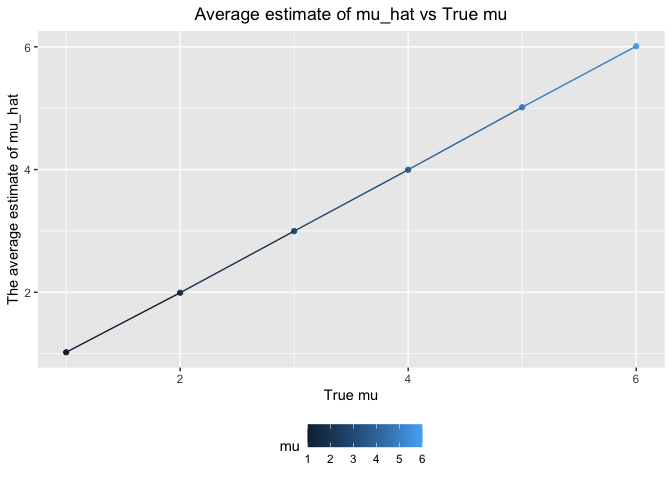

p8105_hw5_zc2610
================
Zuoqiao Cui
2022-11-04

``` r
library(tidyverse)
```

    ## ── Attaching packages ─────────────────────────────────────── tidyverse 1.3.2 ──
    ## ✔ ggplot2 3.3.6      ✔ purrr   0.3.5 
    ## ✔ tibble  3.1.8      ✔ dplyr   1.0.10
    ## ✔ tidyr   1.2.0      ✔ stringr 1.4.1 
    ## ✔ readr   2.1.2      ✔ forcats 0.5.2 
    ## ── Conflicts ────────────────────────────────────────── tidyverse_conflicts() ──
    ## ✖ dplyr::filter() masks stats::filter()
    ## ✖ dplyr::lag()    masks stats::lag()

``` r
library(ggplot2)
```

# Problem 1

1.  Imports the data in individual spreadsheets
2.  Read all documents by path to obtain tibble
3.  Show tibbles in data column

``` r
full_df = 
  tibble(
    files = list.files("data/problem1_data/"),
    path = str_c("data/problem1_data/", files)
  ) %>% 
  mutate(data = map(path, read_csv)) %>% 
  unnest()
```

    ## Rows: 1 Columns: 8
    ## ── Column specification ────────────────────────────────────────────────────────
    ## Delimiter: ","
    ## dbl (8): week_1, week_2, week_3, week_4, week_5, week_6, week_7, week_8
    ## 
    ## ℹ Use `spec()` to retrieve the full column specification for this data.
    ## ℹ Specify the column types or set `show_col_types = FALSE` to quiet this message.
    ## Rows: 1 Columns: 8
    ## ── Column specification ────────────────────────────────────────────────────────
    ## Delimiter: ","
    ## dbl (8): week_1, week_2, week_3, week_4, week_5, week_6, week_7, week_8
    ## 
    ## ℹ Use `spec()` to retrieve the full column specification for this data.
    ## ℹ Specify the column types or set `show_col_types = FALSE` to quiet this message.
    ## Rows: 1 Columns: 8
    ## ── Column specification ────────────────────────────────────────────────────────
    ## Delimiter: ","
    ## dbl (8): week_1, week_2, week_3, week_4, week_5, week_6, week_7, week_8
    ## 
    ## ℹ Use `spec()` to retrieve the full column specification for this data.
    ## ℹ Specify the column types or set `show_col_types = FALSE` to quiet this message.
    ## Rows: 1 Columns: 8
    ## ── Column specification ────────────────────────────────────────────────────────
    ## Delimiter: ","
    ## dbl (8): week_1, week_2, week_3, week_4, week_5, week_6, week_7, week_8
    ## 
    ## ℹ Use `spec()` to retrieve the full column specification for this data.
    ## ℹ Specify the column types or set `show_col_types = FALSE` to quiet this message.
    ## Rows: 1 Columns: 8
    ## ── Column specification ────────────────────────────────────────────────────────
    ## Delimiter: ","
    ## dbl (8): week_1, week_2, week_3, week_4, week_5, week_6, week_7, week_8
    ## 
    ## ℹ Use `spec()` to retrieve the full column specification for this data.
    ## ℹ Specify the column types or set `show_col_types = FALSE` to quiet this message.
    ## Rows: 1 Columns: 8
    ## ── Column specification ────────────────────────────────────────────────────────
    ## Delimiter: ","
    ## dbl (8): week_1, week_2, week_3, week_4, week_5, week_6, week_7, week_8
    ## 
    ## ℹ Use `spec()` to retrieve the full column specification for this data.
    ## ℹ Specify the column types or set `show_col_types = FALSE` to quiet this message.
    ## Rows: 1 Columns: 8
    ## ── Column specification ────────────────────────────────────────────────────────
    ## Delimiter: ","
    ## dbl (8): week_1, week_2, week_3, week_4, week_5, week_6, week_7, week_8
    ## 
    ## ℹ Use `spec()` to retrieve the full column specification for this data.
    ## ℹ Specify the column types or set `show_col_types = FALSE` to quiet this message.
    ## Rows: 1 Columns: 8
    ## ── Column specification ────────────────────────────────────────────────────────
    ## Delimiter: ","
    ## dbl (8): week_1, week_2, week_3, week_4, week_5, week_6, week_7, week_8
    ## 
    ## ℹ Use `spec()` to retrieve the full column specification for this data.
    ## ℹ Specify the column types or set `show_col_types = FALSE` to quiet this message.
    ## Rows: 1 Columns: 8
    ## ── Column specification ────────────────────────────────────────────────────────
    ## Delimiter: ","
    ## dbl (8): week_1, week_2, week_3, week_4, week_5, week_6, week_7, week_8
    ## 
    ## ℹ Use `spec()` to retrieve the full column specification for this data.
    ## ℹ Specify the column types or set `show_col_types = FALSE` to quiet this message.
    ## Rows: 1 Columns: 8
    ## ── Column specification ────────────────────────────────────────────────────────
    ## Delimiter: ","
    ## dbl (8): week_1, week_2, week_3, week_4, week_5, week_6, week_7, week_8
    ## 
    ## ℹ Use `spec()` to retrieve the full column specification for this data.
    ## ℹ Specify the column types or set `show_col_types = FALSE` to quiet this message.
    ## Rows: 1 Columns: 8
    ## ── Column specification ────────────────────────────────────────────────────────
    ## Delimiter: ","
    ## dbl (8): week_1, week_2, week_3, week_4, week_5, week_6, week_7, week_8
    ## 
    ## ℹ Use `spec()` to retrieve the full column specification for this data.
    ## ℹ Specify the column types or set `show_col_types = FALSE` to quiet this message.
    ## Rows: 1 Columns: 8
    ## ── Column specification ────────────────────────────────────────────────────────
    ## Delimiter: ","
    ## dbl (8): week_1, week_2, week_3, week_4, week_5, week_6, week_7, week_8
    ## 
    ## ℹ Use `spec()` to retrieve the full column specification for this data.
    ## ℹ Specify the column types or set `show_col_types = FALSE` to quiet this message.
    ## Rows: 1 Columns: 8
    ## ── Column specification ────────────────────────────────────────────────────────
    ## Delimiter: ","
    ## dbl (8): week_1, week_2, week_3, week_4, week_5, week_6, week_7, week_8
    ## 
    ## ℹ Use `spec()` to retrieve the full column specification for this data.
    ## ℹ Specify the column types or set `show_col_types = FALSE` to quiet this message.
    ## Rows: 1 Columns: 8
    ## ── Column specification ────────────────────────────────────────────────────────
    ## Delimiter: ","
    ## dbl (8): week_1, week_2, week_3, week_4, week_5, week_6, week_7, week_8
    ## 
    ## ℹ Use `spec()` to retrieve the full column specification for this data.
    ## ℹ Specify the column types or set `show_col_types = FALSE` to quiet this message.
    ## Rows: 1 Columns: 8
    ## ── Column specification ────────────────────────────────────────────────────────
    ## Delimiter: ","
    ## dbl (8): week_1, week_2, week_3, week_4, week_5, week_6, week_7, week_8
    ## 
    ## ℹ Use `spec()` to retrieve the full column specification for this data.
    ## ℹ Specify the column types or set `show_col_types = FALSE` to quiet this message.
    ## Rows: 1 Columns: 8
    ## ── Column specification ────────────────────────────────────────────────────────
    ## Delimiter: ","
    ## dbl (8): week_1, week_2, week_3, week_4, week_5, week_6, week_7, week_8
    ## 
    ## ℹ Use `spec()` to retrieve the full column specification for this data.
    ## ℹ Specify the column types or set `show_col_types = FALSE` to quiet this message.
    ## Rows: 1 Columns: 8
    ## ── Column specification ────────────────────────────────────────────────────────
    ## Delimiter: ","
    ## dbl (8): week_1, week_2, week_3, week_4, week_5, week_6, week_7, week_8
    ## 
    ## ℹ Use `spec()` to retrieve the full column specification for this data.
    ## ℹ Specify the column types or set `show_col_types = FALSE` to quiet this message.
    ## Rows: 1 Columns: 8
    ## ── Column specification ────────────────────────────────────────────────────────
    ## Delimiter: ","
    ## dbl (8): week_1, week_2, week_3, week_4, week_5, week_6, week_7, week_8
    ## 
    ## ℹ Use `spec()` to retrieve the full column specification for this data.
    ## ℹ Specify the column types or set `show_col_types = FALSE` to quiet this message.
    ## Rows: 1 Columns: 8
    ## ── Column specification ────────────────────────────────────────────────────────
    ## Delimiter: ","
    ## dbl (8): week_1, week_2, week_3, week_4, week_5, week_6, week_7, week_8
    ## 
    ## ℹ Use `spec()` to retrieve the full column specification for this data.
    ## ℹ Specify the column types or set `show_col_types = FALSE` to quiet this message.
    ## Rows: 1 Columns: 8
    ## ── Column specification ────────────────────────────────────────────────────────
    ## Delimiter: ","
    ## dbl (8): week_1, week_2, week_3, week_4, week_5, week_6, week_7, week_8
    ## 
    ## ℹ Use `spec()` to retrieve the full column specification for this data.
    ## ℹ Specify the column types or set `show_col_types = FALSE` to quiet this message.

    ## Warning: `cols` is now required when using unnest().
    ## Please use `cols = c(data)`

1.  Clean the data format
2.  Make dataframe longer other than wider
3.  Remove unnessary columns

``` r
tidy_df = 
  full_df %>% 
  mutate(
    files = str_replace(files, ".csv", ""), # remove csv
    group = str_sub(files, 1, 3)) %>%  # obtain the first three characters
    pivot_longer(
    week_1:week_8,
    names_to = "week",
    values_to = "outcome",
    names_prefix = "week_") %>% 
  mutate(week = as.numeric(week)) %>% 
  select(-path) # remove path
```

Make a plot showing each group

``` r
tidy_df %>% 
  ggplot(aes(x = week, y = outcome, color = group)) + 
  geom_point() + 
  geom_path() + 
  facet_grid(~group)
```

<!-- -->

Comments:

This plot suggests high within-files correlation – files who start above
average end up above average, and those that start below average end up
below average. files in the control group generally don’t change over
time, but those in the experiment group increase their outcome in a
roughly linear way.

# Problem 2

``` r
homicide_data_df = read_csv("./data/homicide-data.csv") %>% 
janitor::clean_names()
```

    ## Rows: 52179 Columns: 12
    ## ── Column specification ────────────────────────────────────────────────────────
    ## Delimiter: ","
    ## chr (9): uid, victim_last, victim_first, victim_race, victim_age, victim_sex...
    ## dbl (3): reported_date, lat, lon
    ## 
    ## ℹ Use `spec()` to retrieve the full column specification for this data.
    ## ℹ Specify the column types or set `show_col_types = FALSE` to quiet this message.

Raw data decription:

1.  This dataset contains 52179 observations and 12 variables.

2.  Variables include : uid, reported_date, victim_last, victim_first,
    victim_race, victim_age, victim_sex, city, state, lat, lon,
    disposition

Create a new variable “city_state” to combine city and state columns

``` r
homicide_data_df = homicide_data_df %>% 
  mutate(
    city_state = str_c(city, state, sep = ",")
  ) %>% 
  select(-city,-state)
```

Create a new variable to show if this homicide has been solved

``` r
homicide_data_df = homicide_data_df %>% 
  mutate(
    whether_solved = case_when(
      disposition == "Closed without arrest" ~ "unsolved",
      disposition == "Open/No arrest" ~ "unsolved",
      disposition == "Closed by arrest" ~ "solved"
    )
  )
```

Obtain the total number of homicides and the number of unsolved
homicides

``` r
num_of_homicide_df = homicide_data_df %>% 
  group_by(city_state) %>% 
  summarise(
    homicide_total = n(),
    homicide_unsolved = sum(whether_solved == "unsolved")
  ) 
num_of_homicide_df
```

    ## # A tibble: 51 × 3
    ##    city_state     homicide_total homicide_unsolved
    ##    <chr>                   <int>             <int>
    ##  1 Albuquerque,NM            378               146
    ##  2 Atlanta,GA                973               373
    ##  3 Baltimore,MD             2827              1825
    ##  4 Baton Rouge,LA            424               196
    ##  5 Birmingham,AL             800               347
    ##  6 Boston,MA                 614               310
    ##  7 Buffalo,NY                521               319
    ##  8 Charlotte,NC              687               206
    ##  9 Chicago,IL               5535              4073
    ## 10 Cincinnati,OH             694               309
    ## # … with 41 more rows

1.  Estimate the proportion of homicides that are unsolved in
    Baltimore,MD and save the output of prop.test

2.  Pull the estimated proportion and confidence intervals from the
    resulting tidy dataframe

``` r
Baltimore_unsolved_homicide_df = num_of_homicide_df %>% 
  filter(city_state == "Baltimore,MD")
  x = Baltimore_unsolved_homicide_df %>%
    pull(homicide_unsolved)  
  n = Baltimore_unsolved_homicide_df %>%
    pull(homicide_total)
result_df = prop.test(x,n) %>% 
  broom::tidy()
result_df
```

    ## # A tibble: 1 × 8
    ##   estimate statistic  p.value parameter conf.low conf.high method        alter…¹
    ##      <dbl>     <dbl>    <dbl>     <int>    <dbl>     <dbl> <chr>         <chr>  
    ## 1    0.646      239. 6.46e-54         1    0.628     0.663 1-sample pro… two.si…
    ## # … with abbreviated variable name ¹​alternative

``` r
# pull the estimated proportion and confidence intervals from the resulting tidy dataframe.
result_df %>% 
  select(estimate,conf.low,conf.high)
```

    ## # A tibble: 1 × 3
    ##   estimate conf.low conf.high
    ##      <dbl>    <dbl>     <dbl>
    ## 1    0.646    0.628     0.663

1.  Estimate the proportion of homicides that are unsolved in each city

2.  Tidy hypothesis outputs of the dataframe (Remove “Tulsa,AL” before
    making hypothesis test since there is no unsolved homicides in this
    city therefore CI and proportion don’t need to be estimated )

3.  Create a new dataframe containing variables in num_of_homicide_df
    dataframe and two new variables: City_unsolved_homicide and
    Tidy_city_unsolved_homicide which include lists of hypothesis
    outputs

4.  Create a tidy dataframe with estimated proportions and CIs for each
    city

``` r
num_of_homicide_df = num_of_homicide_df %>% 
  filter(city_state != "Tulsa,AL")
  x = num_of_homicide_df %>%
  pull(homicide_unsolved) 
  n = num_of_homicide_df %>% 
  pull(homicide_total) 
  hypothesis_result_df = num_of_homicide_df %>% 
    mutate(
      City_unsolved_homicide =  map2(x,n,prop.test),
       # Tidy hypothesis outputs of the dataframe
      Tidy_city_unsolved_homicide = map(City_unsolved_homicide, broom::tidy)
    ) %>% 
    select(city_state,Tidy_city_unsolved_homicide)
    tidy_hypothesis_result_df = unnest(hypothesis_result_df) %>% 
    select(city_state,estimate,conf.low,conf.high)
```

    ## Warning: `cols` is now required when using unnest().
    ## Please use `cols = c(Tidy_city_unsolved_homicide)`

``` r
    tidy_hypothesis_result_df
```

    ## # A tibble: 50 × 4
    ##    city_state     estimate conf.low conf.high
    ##    <chr>             <dbl>    <dbl>     <dbl>
    ##  1 Albuquerque,NM    0.386    0.337     0.438
    ##  2 Atlanta,GA        0.383    0.353     0.415
    ##  3 Baltimore,MD      0.646    0.628     0.663
    ##  4 Baton Rouge,LA    0.462    0.414     0.511
    ##  5 Birmingham,AL     0.434    0.399     0.469
    ##  6 Boston,MA         0.505    0.465     0.545
    ##  7 Buffalo,NY        0.612    0.569     0.654
    ##  8 Charlotte,NC      0.300    0.266     0.336
    ##  9 Chicago,IL        0.736    0.724     0.747
    ## 10 Cincinnati,OH     0.445    0.408     0.483
    ## # … with 40 more rows

1.  Create a plot that shows the estimates and CIs for each city

2.  Organize cities according to the proportion of unsolved homicides
    and save the plot to a file folder.

``` r
tidy_hypothesis_result_df = tidy_hypothesis_result_df %>% 
  mutate(
    city_state = fct_reorder(city_state, estimate)
  ) %>% 
  ggplot(aes(x = city_state,y = estimate,color = city_state)) +
  geom_point() +
  geom_errorbar(aes(ymax = conf.high,ymin = conf.low)) +
  labs(
    title = "Estimated proportions and CIs of unsolved homicides in each city",
     x = "City & State",
     y = "Estimated Proportion",
    caption = "Data from [Attribution-NonCommercial-ShareAlike 4.0 International (CC BY-NC-SA 4.0) license]"
  ) +
  theme(axis.text.x = element_text(angle = 60, hjust = 1),plot.title = element_text(hjust = 0.5),legend.position = "none")

tidy_hypothesis_result_df
```

<!-- -->

``` r
  ggsave("./plots/Estimated_proportions_and_CIs_for_each_city.pdf",tidy_hypothesis_result_df, width = 8, height = 5)
```

# Problem 3

Create a function to output mu_hat and p.value of a normal distribution
where n =30 and sigma(sd) = 5 arising from t-test

``` r
sim_estimate_pvalue = function(n = 30, mu, sd = 5){
  simulation_data = tibble(
    x = rnorm(n, mean = mu ,sd) #generate data from normal distribution
  )
  simulation_data %>% 
    summarize(
      mu_hat = t.test(x,conf.level = 0.95) %>%
        broom::tidy() %>%
        pull(estimate),
      p_value = t.test(x,conf.level = 0.95) %>%
        broom::tidy() %>%
        pull(p.value)
    )
}
```

Set mu=0, generate 5000 datasets from the model x∼Normal\[μ,σ\] and save
mu_hat and p.value arising from a test of H:μ=0 α=0.05 using a for loop

``` r
output = vector("list",length = 50)
for (i in 1:50){
  output[[i]] = sim_estimate_pvalue(30,0,5)
}
bind_rows(output)
```

    ## # A tibble: 50 × 2
    ##     mu_hat p_value
    ##      <dbl>   <dbl>
    ##  1 -0.720  0.413  
    ##  2 -0.179  0.846  
    ##  3 -0.866  0.260  
    ##  4  2.11   0.00823
    ##  5  0.764  0.264  
    ##  6  0.380  0.650  
    ##  7 -0.954  0.301  
    ##  8 -0.795  0.341  
    ##  9  0.164  0.869  
    ## 10  0.0367 0.965  
    ## # … with 40 more rows

Repeat the above for mu={1,2,3,4,5,6}

``` r
sim_results = tibble(
  mu = c(1,2,3,4,5,6)
) %>% 
  mutate(
    output_lists = map(.x = mu,~rerun(50,sim_estimate_pvalue(30,.x,5))),
    estimate_df = map(output_lists,bind_rows)
  ) %>% 
  select(-output_lists) %>% 
  unnest(estimate_df) #expand the tibble list two show the two columns: mu and p_value
```

Create a new variable named conclusion to show whether the null
hypothesis is rejected (since α=0.05, then p_value should be compared
with 0.05 to determine whether the null hypothesis is rejected(when
p_value \< 0.05))

``` r
sim_results = sim_results %>% 
  mutate(
    conclusion = case_when(
      p_value < 0.05 ~ "reject",
      p_value >= 0.05 ~ "fail to reject"
    )
  )
sim_results
```

    ## # A tibble: 300 × 4
    ##       mu mu_hat    p_value conclusion    
    ##    <dbl>  <dbl>      <dbl> <chr>         
    ##  1     1  2.02  0.0674     fail to reject
    ##  2     1  3.63  0.00000494 reject        
    ##  3     1  0.400 0.646      fail to reject
    ##  4     1  0.190 0.821      fail to reject
    ##  5     1  2.07  0.0218     reject        
    ##  6     1 -0.728 0.375      fail to reject
    ##  7     1  0.994 0.289      fail to reject
    ##  8     1  1.44  0.107      fail to reject
    ##  9     1  1.92  0.0102     reject        
    ## 10     1 -0.287 0.795      fail to reject
    ## # … with 290 more rows

1.  Count the number of total conclusions with each true mu

2.  Count the number of “reject” conclusions with each true mu

3.  Calculate the proportion of times the null was rejected

4.  Make a plot showing the proportion of times the null was rejected
    (the power of the test) on the y axis and the true value of μ on the
    x axis.

``` r
proportion_reject = sim_results %>% 
  group_by(mu) %>% 
  summarise(
    conclusion_total = n(),
    conclusion_reject = sum(conclusion == "reject")
  ) %>% 
  mutate(
    proportion = conclusion_reject/conclusion_total
  ) %>% 
  ggplot(aes(x = mu, y = proportion, color = mu)) +
  geom_point() +
  geom_line() +
  labs(
    title = "The association between effect size and power",
     x = "True mu",
     y = "Proportion of times the null was rejected"
  ) +
  theme(plot.title = element_text(hjust = 0.5))

proportion_reject
```

<!-- -->

``` r
 ggsave("./plots/The_association_between_effect_size_and_power.pdf",proportion_reject, width = 8, height = 5)
```

Description:

1.  When the effect size (true mu) is increasing, the power of the test
    is increasing at the same time.

2.  When the effect size (true mu) is greater than 4, the power of the
    test is infinitely close to 1

Make a plot showing the average estimate of mu_hat on the y axis and the
true value of μ on the x axis.

``` r
average_estimate_mu = sim_results %>% 
  group_by(mu) %>% 
  summarise(
    average_mu_hat = mean(mu_hat)
  ) %>% 
  ggplot(aes(x = mu , y = average_mu_hat, color = mu )) +
  geom_point() +
  geom_line() +
  labs(
    title = "Average estimate of mu_hat vs True mu",
     x = "True mu",
     y = "The average estimate of mu_hat"
  ) +
  theme(plot.title = element_text(hjust = 0.5),legend.position = "bottom")

average_estimate_mu
```

<!-- -->

``` r
ggsave("./plots/Average_estimate_of_mu_hat_vs_True_value_of_mu.pdf",average_estimate_mu, width = 8, height = 5)
```

Make a second plot the average estimate of μ̂ only in samples for which
the null was rejected on the y axis and the true value of μ on the x
axis.

``` r
average_estimate_mu_reject = sim_results %>% 
  filter(conclusion == "reject") %>% 
  group_by(mu) %>% 
  summarise(
    average_mu_hat_reject = mean(mu_hat)
  ) %>% 
  ggplot(aes(x = mu , y = average_mu_hat_reject, color = mu )) +
  geom_point() +
  geom_line() +
  labs(
    title = "Average estimate of mu_hat vs True mu for 'rejected' samples",
     x = "True mu",
     y = "The average estimate of mu_hat"
  ) +
  theme(plot.title = element_text(hjust = 0.5),legend.position = "bottom")
  
average_estimate_mu_reject
```

<!-- -->

``` r
ggsave("./plots/Average_estimate_of_mu_hat_vs_True_value_of_mu_for_reject_samples.pdf",average_estimate_mu, width = 8, height = 5)
```

Answer:

1.  When the true value of mu is from 1 to 3, the sample average of
    mu_hat across tests for which the null is rejected isn’t
    approximately equal to the true value of mu

2.  When the true value of mu is from 4 to 6, the sample average of
    mu_hat across tests for which the null is rejected is approximately
    equal to the true value of mu
